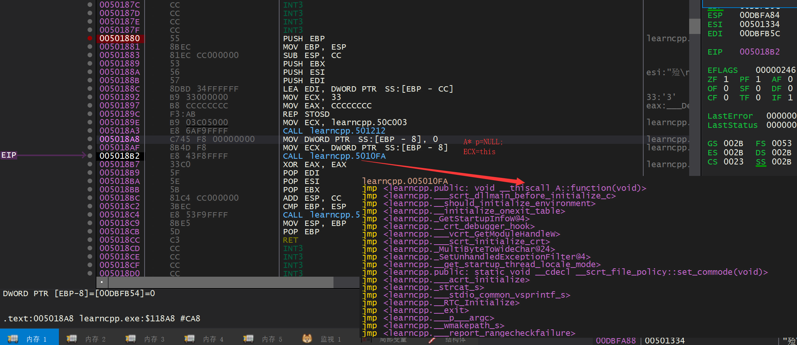

## 要复习的

- 进程和线程的区别和其使用等
- 智能指针
- 中序遍历的非递归写法
- 多线程的同步方法和如何使用
-     - 锁- 中断- 信号量- 原子操作- ..
- 进程间通信的方法，还有它和 socket 通信的相同和不同点- 在哪儿
- 管道- 消息- 共享文件-unix:///.sock
- linux 的进程间通信和 windows
- malloc 和 alloc 的区别
- vector 何时进行空间的搬运
- 大批量对象的搬运进行了怎样的优化
- placement new 和 operator new 的不同表现
- 要 vector 的新空间为 2 倍
- 操作系统的页和操作系统对进程的内存分配方式还有段页- 的情况

```cpp
//运行结果，汇编代码
class A {
public:
    void f1() {}
    virtual void f2() {}
}
A* a = nullptr;
a->f1();
a->f2();
```


拥塞避免算法、操作系统的 LRU、如何对反爬虫机制进行破解、判断一棵二叉树是不是二叉搜索树、嵌套数组的环形遍历、乐观锁和悲观锁有啥区别、求二叉树是否存在和为 N 的路径、针对每个连接维护一个线程，开销很大，如何优化、有一个单链表，奇数位是升序的，偶数位是降序的，要求进行给它进行排序 1->200->10->120->30->8->88->4、中断实现机制，软硬中断的区别、redis 线程模型、topk 问题、聚集索引，非聚集索引、http2

### 将一棵二叉搜索树转换成双向链表

https://blog.csdn.net/zengzhen_csdn/article/details/51198530

### 红黑树

https://www.jianshu.com/p/0b68b992f688

## 安天

1. 常见的数据结构都有哪些，set 的实现原理
2. 静态分析工具的使用
3. 样本分析

## 腾讯

硬件断点、软件断点、单步原理。调试器原理。反调试手法、SEH、VEH，异常处理,CE 原理。

## 头条 安全

1. Linux 基本命令、xargs，mysql 花式索引，https/SSL ，证书原理、输入 url 点击后背后发生的事，同源策略，xss，csrf，tcp/ip，arp、icmp、go 语言数组和 slice 区别与坑

2. pe 文件结构，hook 原理，windows 函数调用，linux 函数调用，windows，linux 系统调用原理。windows 漏洞利用，rop，aslr 绕过，内核漏洞利用。linux 漏洞利用，linux 堆栈漏洞，ctf 经历，内核漏洞利用，内核保护原理，写一道简单算法，2 道汇编，一道函数调用汇编，一道汇编实现 memcpy, hook 原理

3) xss 防范，fuzz

## 360 企业安全

sql 注入类型，判断注入，原理，手写 payload(时序)，防护，mysql、oracle、sqlserver 注入区别，上传所有绕过方法，原理，解析漏洞，逻辑漏洞，XSS 类型，绕过技巧，防护，过滤'<'等还可以 XSS 吗？Java 三大框架，序列化/反序列化，OSI 七层，sqlmap 各种命令，https 注入参数，payload 回显参数，nmap 扫描存活，waf 绕过，双编码绕过，nmap 原理，判断存活方法,2345xx http 状态吗

## 防御方

sql 注入类型，防护，
mysql,oracle TiDB mongoDB,Couch 注入防护，加固
上传绕过方法，原理，防御
解析漏洞，逻辑漏洞原理，
xss 类型，绕过技巧，如何防御
Java 三大框架
php，序列化反序列化原理，防御
OSI 七层模型，
TCP syn floor 原理
nmap 扫描防御
http 状态吗，500 502 403 405 401 400 204
重放攻击防御
SSL、TLS 是什么
如何配置 https 证书
