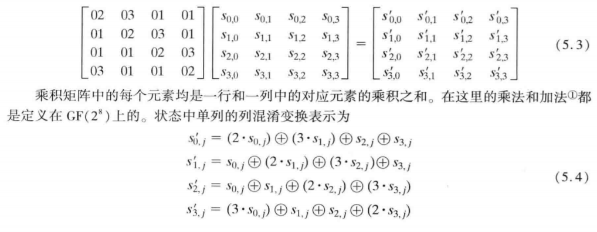

# AES
全部理解AES加密，需要有限域，有限域多项式运算相关的知识。
明文分组长度是16字节，密钥长度根据AES-128、AES-192、AES-256变化。  
四个阶段，一个置换和三个代替：
字节代替：S 盒替换字节
行移位： 行移位，一个简单的置换
列混淆： 在 GF(2^n)上进行一个矩阵乘法
轮密钥加：按位 XOR
S盒：输入8bit数据，输出对应的8bit数据，是一对一的关系，逆S盒是S盒的逆运算，具体构造后文再讲。

## 总体加s密过程
//TODO: AES image
输入是16字节，被分割为4*4方针，复制一份到状态分组，这个分组会被各个阶段被修改。
密钥也会进行字节分组，同时进行扩展。16字节的密钥会扩展到44*4字节，注意这些分组是以列进行的。
//TODO:AES数据结构
加密的轮数和密钥长度相关，16字节->10轮，24字节->12轮，32字节->14轮，前N-1轮都是由4个操作组成：字节代替，行移位，列混淆，轮密钥加，最后一轮只有三个操作（没有列混淆），第一轮起始之前有一个轮密钥加，可以视为第0轮。每一轮输入4X4矩阵，输出4X4矩阵
//TODO:5.3 AES加密解密过程
特点：
1. 不是*feistel*结构
2. 在开始和结束中的**轮密钥加**阶段使用密钥，如果不在开始或结束阶段使用，那么在不知道密钥的情况下就可以计算器逆，故不能增加安全性。
3. 本身轮密钥加不难破解，但是其他三个阶段提供了**混淆、扩散** 以及非线性功能。所以非常有效和安全，缺一不可。
4. 虽然解密算法按逆序方式扩展了密钥，但解密算法和加密算法并不一样。
5. 最后一轮只有三个阶段，使得加密算法可逆。

## 四个阶段——字节代替
  就是查表操作，表是 $16 /times 16$格式，每个字节**高4位**作为**行**坐标，**低四位**作为**列**坐标，进行查表，这个表称之为**S盒**，反向操作叫做**逆S盒**

### S盒和逆S盒构造方法

1. 初始化，`[0x00 0x01 0x02...0x0f]`作为一行，这样就有一个$16 \times 16$的二维数组，第a行b列的值为0xab.
2. 上面每个数求得在有限域$GF(2^8)$中的逆，0x00还是 映射为00
3. 记S盒中每个字节为 $b_7b_6b_5b_4b_3b_2b_1b_0$,对S盒中每个字节做如下变换:
$$b_i=b_i \oplus  b_{i+4\mod 8} \oplus b_{i+5\mod 8} \oplus b_{i+6 \mod 8} \oplus b_{i+7\mod 8} \oplus c_i$$
其中`c=0x63`。这个过程可以用下面的矩阵标示：
$$
\begin{bmatrix} 
b_0\\
b_1\\
b_2\\
b_3\\
b_4\\
b_5\\
b_6\\
b_7\\
\end{bmatrix}
=
\begin{bmatrix} 
1 & 0 & 0 & 0 & 1 & 1 & 1 & 1 \\ 
1 & 1 & 0 & 0 & 0 & 1 & 1 & 1 \\
1 & 1 & 1 & 0 & 0 & 0 & 1 & 1 \\
1 & 1 & 1 & 1 & 0 & 0 & 0 & 1 \\
1 & 1 & 1 & 1 & 1 & 0 & 0 & 0 \\
0 & 1 & 1 & 1 & 1 & 1 & 0 & 0 \\
0 & 0 & 1 & 1 & 1 & 1 & 1 & 0 \\
0 & 0 & 0 & 1 & 1 & 1 & 1 & 1 \\

\end{bmatrix}

\begin{bmatrix} 
b_0\\
b_1\\
b_2\\
b_3\\
b_4\\
b_5\\
b_6\\
b_7\\
\end{bmatrix}
+
\begin{bmatrix} 
1\\
1\\
0\\
0\\
0\\
1\\
1\\
0\\
\end{bmatrix}

$$
4. 根据矩阵运算规则，很容易推导出逆矩阵的运算公式：
$$b_i= b_{i+2\mod 8} \oplus b_{i+5\mod 8} \oplus b_{i+7 \mod 8} \oplus d_i$$
其中`d=0x5`

## 四个阶段——行移位变换
有正向和逆向操作，正向操作如下

1. 第1行不变
2. 第2行循环左移1个字节
3. 第3行循环左移2个字节
4. 第4行循环左移3个字节
   
逆向操作就是反过来了，例如第二行右移一个字节

## 四个阶段——列混淆变换


实际上就是矩阵乘法，不过要注意的是这个乘法和加法是在$GF(2^8)$上进行的。
逆向变换只需要乘以逆矩阵，这个逆矩阵也是在$GF(2^8)$上得到。


## 四个阶段——轮密钥加变换
这个阶段最简单，和扩展后的密钥进行异或操作即可。显然也是16字节一组。

# AES密钥扩展
  输入16字节，输出176字节，作用于每一轮加密中的最后一个阶段。这个算法不是很复杂，还是由基本的异或，移位，字节代替完成。伪代码如下：

```c++
// 这里一个字是4字节m,输入key，输出w
AES_key_expansion(byte key[16], word w[44])
{
  word temp;
  for(i=0;i<4;i++){
    // 初始化w数组，将key复制到w前4个word中
    w[i]={key[4*i],key[4*i+1],key[4*i+2],key[4*i+3]}
  }
  //前4个已经初始化过了，从第5个字开始做字节扩展
  for(i=4;i<44;i++){
    //上一组key
    temp=w[i-1];
    //新的一组key，更新temp
    if(i %4==0){
    //字节移位，循环左移一个字节，[0,1,2,3] -> [1,2,3,0]
      temp=Rotword(temp);
    // 从S盒中进行替换
      temp=SubWord(temp);
    //Rcon是固定的，每一轮的值不同，如下：
    //Rcon={0x01000000,0x02000000,0x04000000...}
    //第2 3 4字节都为0，第一个字节为上一组二倍，当然，乘2是在域GF(2^8)进行的。
      temp^=Rcon[i/4];
    }
    //最后和temp作xor运算。
    w[i]=w[i-4]^temp
  }
}
```
作用：防止已有的密码分析攻击。使用不同的Rcon（轮常量）可以防止轮密钥产生的对称性和相似性。  
标准：
1. 知道密钥或者轮密钥某些位不能计算出其他位。
2. 可逆变换。
3. 能够在各种处理器上执行。
4. 密钥每个位都会影响轮密钥产生。
5. 简单。