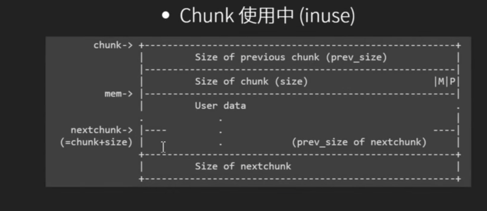
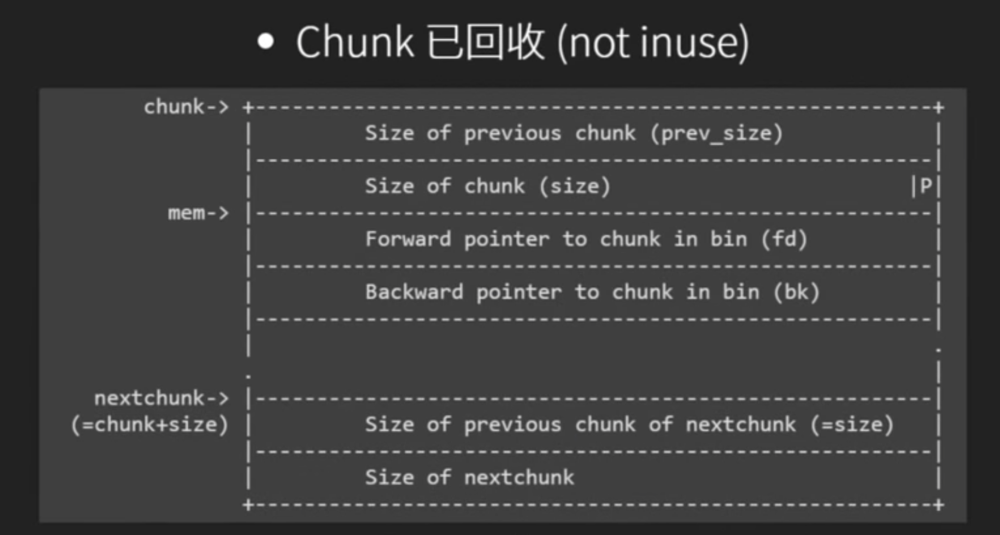
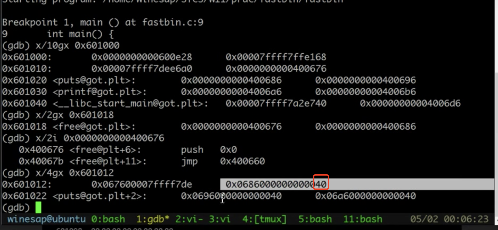
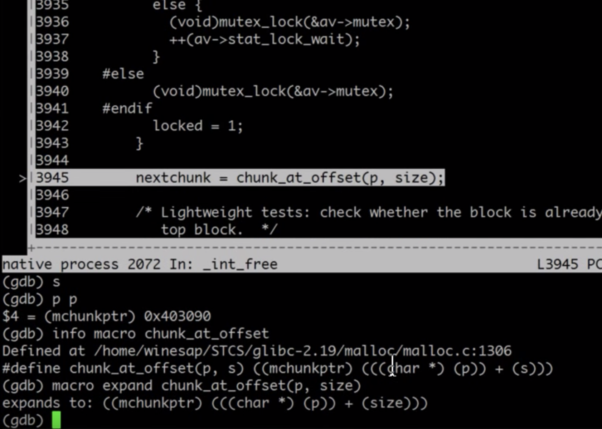

##流程
第一次malloc size<128K时候系统直接给132KB内存,大于则使用mmap

Allocated chunk
Free chunk
Top chunk
## 堆数据结构
- 存放chunk的metadata的chunk的结构(header)
  
```c
struct malloc_chunk{
    size_t prev_size; //qword 可能存放上一个chunk的data
    size_t size;//qword size最低位表示上一个chunk是否在使用（prev_inuse）
    malloc_chunk *fd; //会被data覆盖
    malloc_chunk *bk;//会被data覆盖
    malloc_chunk *fd_nextsize;//会被data覆盖
    malloc_chunk *bk_nextsize;//会被data覆盖
}
```
使用中的chunk

mem=malloc(size)
- chunk = mem-16;
- chunksize = (size+8)#16
- chunk的地址是malloc得到的地址-16
- chunksize是size+8向上对齐16的整数倍
- 一般情况下free的时候会检查前后空间是不是free，如果是free将会合并
- 带debug symbol的lib可以直接看各种bin和结构体
(gdb)p main_arena

回收的chunk


## main_arena header
- malloc_state
- 存在各种bin top chunk信息
- 位于libc的bss段中
## Fastbin
- 不会取消inuse flag
- Chunk size <= get_max_fast()的chunk，会被放在fastbin的bin里
- 64bit是128bytes，32bit是64bytes
- global_max_fast 一开始是0
- Fastbin是single linked list，只能使用fd，以NULL结尾
- Chuk Size从32开始，共7个可用的fastbin
32、48、64、80、96、112、128（0x20 0x30 0x40 0x50 0x60 0x70)
- 32位 fastbin size（0x10 0x18 0x20... 0x40)

## unsorted bin
- 双向环形链表
- 每次分配找的大小一样
- 当free大小不在fastbin，为了效率，先放入到unsorted bin，一段时间后再放入对应的bin中
- 下次malloc先找unsorted bin中是否有适合的chunk
  
## small bin
- 双向环形链表
- chunk size < 512(32bit)
- FIFO
- 根据大小分成62个大小不同的bin
- 16 24...80 88...508

## large bin
- 双向环形链（sorted)
- chunk size >=512(32bit)
- 不是一个固定大小的更加
- 前32个bin 512+64...
- 32-48bin 2496+512...;
- 每个bin中大的chunk在前面，小的chunk放在后面
- unsorted bin small bin large bin 组成 一个chunk array

### malloc时检查
- malloc和free会对chunk进行检查，但检查fastbin的很少，比如说fastbin[2]的chunk size必须为64
- free的时候不会取消下一个chunk的prev_inuse_bit 因为fastbin chunk不会和其他chunk合并
  
### free时的检查
malloc.c: _int_free
- free的地址要16bit align
- chunk 头和尾size要对，size不能太大
- 下一个chunk的size不能过小

## double free
- double free可以改变fd，拿到任意地址进行读写
- fastbin只检查bin中的第一块chunk，只要不是连续free同一块chunk就没关系(fasttop)检查
```c
//假设p、q都小于global_max_fast
    free(q);
    //fastbin->q
    free(p);
    //fastbin->p->q
    free(q);
    //          <-
    //fastbin->q->p
    //不会报错
    //再malloc就会无限拿到p、q的地址...
```

## tips

64位got地址40开头，可以把0x40当作chunk_size用来绕过libc的检查。那么malloc应该是56字节，


## 堆合并
- chunk不位mmaped
- 下一个是top chunk，上一块是free chunk
- 最后合并到top chunk
- 下一块不是top chunk时，上或下是free chunk
- 检查下一个chunk的prev_inuse bit，如果为0则double free
- P->bk->df==P && P->fd->bk==P(corrupted double linked list)
下图是size>128的堆合并过程，用gdb调试的时候有两个技巧
- `info macro [macroname]`  显示宏
- `macro expand [code]`  展开宏


### unlink 
- 将free的上（下）一个chunk拿掉，进行merge
- 加入 unsorted bin
```c
// double link list 拿掉一个
//p BK FD 都是chunk structure指针
#define unlink(P,BK,FD) {\
    FD = P->fd;\
    BK = P->bk;\
    FD->bk=BK;\
    BK->fd=FD;\
}

if(!prev_inuse(p)){
    prevsize = p->prev_size;
    size += prevsize;
    p = chunk_at_offset(p,-((long) prevsize));
    unlink(p,bak,fwd);
}
```
拿出来后会把合并后的chunk放到另一个bin里。
前一个chunk可以覆盖到p的prev_size ，那么就可以控制unlink中p的位置，从而控制fd，bk的内容，例如
- FD = p->fd = free@got.plt-0x18
- BK = p->bk = shellcode
上面跑完后会把free的addres写为shellcode的address（FD和FD->bk的偏移为0x18），但同时，shellcode里（BK）的位置（Bk->fd）会被改掉（FD），所以shellcode里要用jmp跳过

*上述方法现在已经里用不了了*  
现在的unlink会检查双向链表是不是合法但，指针要能指回来。
```c
#define unlink(P,BK,FD){\
    FD = P -> fd;\
    BK = P -> bk;\
    if(FD->bk!=P || BK->fd!=P)\
        malloc_printerr(check_action,"corrupted d..",P);\
    else{\
        FD->bk=BK;\
        BK->fd=FD;\
    }\
}
```
绕过方法：需要一个可读写的chunk p，知道&p（p是global的） 
- FD=P->fd=&P-0x18
- BK=P->bk=&pP-0x10
- result：p=&p-0x18 ，p指向了p的地址-0x18

利用：需要一个overflow来改写prevsize，使free时候的p为global的heap

## mmap Chunks overflow

前提：需要任何大小的的malloc，但不需要free。  
当malloc size超过0x21000时，会改用mmap直接申请新的空间
mmap得到的地址是连续的，同通常是在上一次mmap之前，通常在tls段，malloc时会分局tls段上某个指针来决定使用的arena,
mmap chunk overflow可以覆盖arena的指针，
tls段上还有stack address stack guard canary  
伪造arena的fastbin部分，使下次malloc时可以取得的chunk
